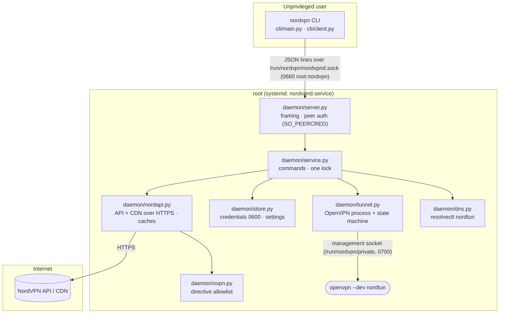
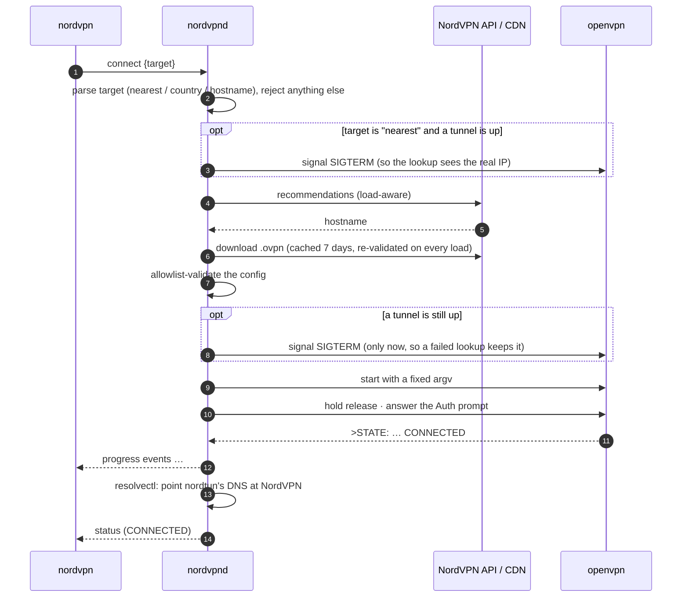
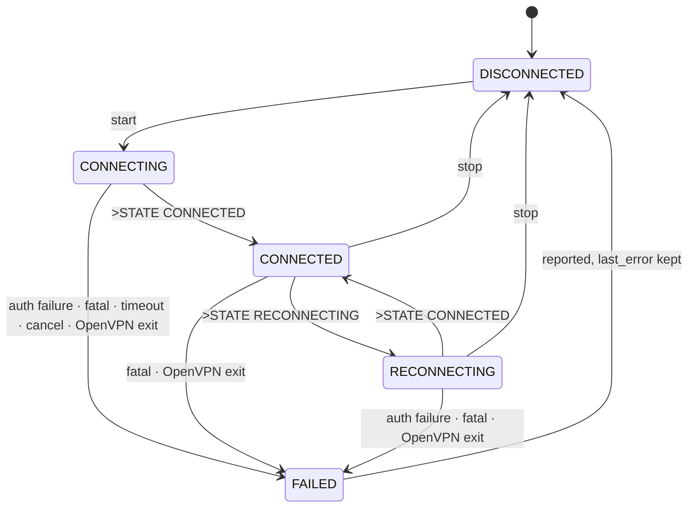

# Architecture

## Protocol

Each message is one JSON object on one line, UTF-8, at most 64 KiB (`protocol.py`).

- Request: `{"v": 1, "id": N, "cmd": "...", "args": {...}}`
- Progress event (only during `connect`): `{"v": 1, "id": N, "event": "state", "state": "...", "detail": "..."}`
- Final response: `{"v": 1, "id": N, "ok": true, "result": {...}}` or `{"v": 1, "id": N, "ok": false, "error": {"code": "...", "message": "..."}}`

Commands: `status`, `connect {target}`, `disconnect`, `login {username, password}`, `logout`, `countries`, `settings.get`, `settings.set {key, value}`. If the client hangs up during a `connect`, the daemon cancels the attempt. Every other command runs to completion.

## Connecting

## Tunnel states

`FAILED` is reported, and then the tunnel returns to `DISCONNECTED` with `last_error` set, which `status` shows. Teardown always runs to completion, even if the request that started it is cancelled.

## Testing

- Unit tests cover each module.
- Integration tests run the real server and service in-process, driving `tests/fakes/fake_openvpn.py` over a real management socket.
- The e2e tests (`tests/e2e`) install the real `.deb` in a systemd container and connect through real OpenVPN to a fake NordVPN container.
